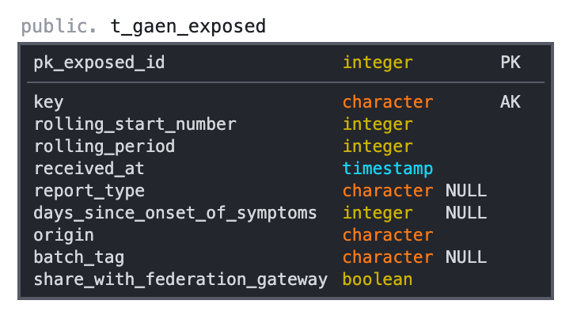
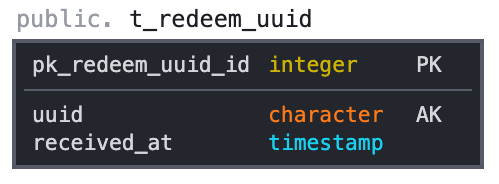
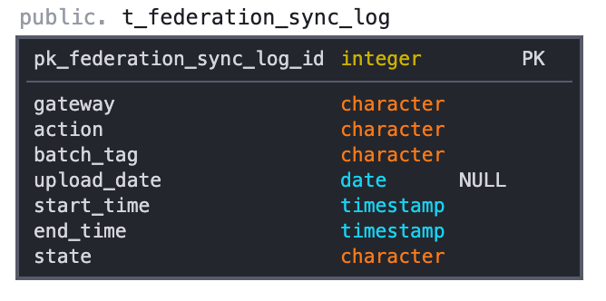

<!-- Issue templates and Contributing guides are taken from the fastlane repository and adjusted for our needs (https://github.com/fastlane/fastlane/tree/master/.github/ISSUE_TEMPLATE) and  -->
# DP3T-Backend-SDK


[](https://sonarcloud.io/dashboard?id=DP-3T_dp3t-sdk-backend)
[](https://sonarcloud.io/dashboard?id=DP-3T_dp3t-sdk-backend)

## License
This project is licensed under the terms of the MPL 2 license. See the [LICENSE](LICENSE) file.

## Repositories
* Android SDK & Calibration app: [dp3t-sdk-android](https://github.com/DP-3T/dp3t-sdk-android)
* iOS SDK & Calibration app: [dp3t-sdk-ios](https://github.com/DP-3T/dp3t-sdk-ios)
* Android Demo App: [dp3t-app-android](https://github.com/DP-3T/dp3t-app-android)
* iOS Demo App: [dp3t-app-ios](https://github.com/DP-3T/dp3t-app-ios)
* Backend SDK: [dp3t-sdk-backend](https://github.com/DP-3T/dp3t-sdk-backend)

## DP3T
The Decentralised Privacy-Preserving Proximity Tracing (DP3T) project is an open protocol for COVID-19 proximity tracing using Bluetooth Low Energy functionality on mobile devices, which ensures that personal data and computation stay entirely on an individual's phone. It was produced by a core team of over 25 scientists and academic researchers from across Europe. It has also been scrutinized and improved by the wider community.

DP3T is a free-standing effort, begun at the EPFL and ETHZ, where the protocol was produced and where the implementation into an open-sourced app and server is taking place.

## Contribution Guide

Please read the [Contribution Guide](CONTRIBUTING.md) before submitting any pull-request.

## Introduction
This documentation describes the backend used for the SwissCovid application. It is focused on providing information for the requests used for the Exposure Notification framework. Although, code of the old format is still provided, no documentation or support is available except the code itself.

## Federation Gateway Service
### Introduction 
Since multiple countries are now using the Exposure Notifications Framework, the European Union started an effort to allow federation of keys coming from multiple countries. Every country connected to the gateway can then up- and download keys from all participating countries (relayed via the gateway). This means that people e.g. using the Swiss app in Germany can, if they decide to share the keys with Germany, infect people in Germany and vice versa.

For this another module was added, which periodically synchronizes keys, which are marked for sharing to a gateway service. The official European Federation Gateway Service (EFGS) can be found [here](https://github.com/eu-federation-gateway-service/efgs-federation-gateway). The [Swiss fork](https://github.com/admin-ch/chgs-federation-gateway) adds Postgres-Support as well as some other minor features.

Further information on the Interoperability Module can be found in the [dpppt-backend-sdk-interops module](dpppt-backend-sdk/dpppt-backend-sdk-interops/README.md)

## Reproducible Builds
In order to have reproducible builds the [io.github.zlika](https://github.com/zlika/reproducible-build-maven-plugin) maven plugin is used. It replaces all timestamp with the timestamp of the last commit, and orders the entries in the JAR alphabetically. The github action then computes the sha256sum of the resulting JAR and adds the output as an build artifact.

## Dependencies
* Spring Boot 2.2.10
* Java 11 (or higher)
* Logback
* [Springboot-Swagger-3](https://github.com/Ubique-OSS/springboot-swagger3) (From Bintray)

### Database
For development purposes an hsqldb can be used to run the web service locally. For production systems, it is recommended to connect to a PostgreSQL database (cluster if possible).

#### Keys

The keys that are stored in the database contain the `GAEN` key data as specified by Google/Apple, as well as some more fields to indicate the origin of the keys, and if the keys should be shared with a federation gateway. For the federation gateway a further field `batch_tag` is needed to indicate the batch this key has been uploaded with.



| Column                        | Description                                                                                                                |
| ----------------------------- |:--------------------------------------------------------------------------------------------------------------------------:|
| pk_exposed_id                 |                                                                                                                            |
| key                           |                                                                                                                            |
| rolling_start_number          |                                                                                                                            |
| rolling_period                |                                                                                                                            |
| received_at                   |                                                                                                                            |
| rolling_start_number          |                                                                                                                            |
| report_type                   | The `reportType` indicating how the person uploading the key was "verified" (e.g. confirmed test)                          |
| days_since_onset_of_symptoms  | c.f. [Interops documentation](dpppt-backend-sdk/dpppt-backend-sdk-interops/README.md)                                      |
| origin                        | String where this key was retrieved from [ISO-3166-1-Alpha-2](https://en.wikipedia.org/wiki/List_of_ISO_3166_country_codes)|
| batch_tag                     | If uploaded to EFGS, indicates the `batchTag` of the batch this key was uploaded with                                      |
| share_with_federation_gateway | Indicate if this key should be shared with the federation gateway                                                          |


#### JWT

This schema contains the `uuid` field to be stored temporarily. This is used to prevent replay attacks of the same token twice and the entry will be removed, after the validity of the token has been expired.




| Column                        | Description   |
| ----------------------------- |:-------------:|
| pk_redeem_uuid_id             |               |
| uuid                          |               |
| received_at                   |               |

#### Federation

To allow a monitoring of uploads to a federation gateway, this table holds log entries indicating different actions and error messages.



| Column                        | Description                                                                           |
| ----------------------------- |:-------------------------------------------------------------------------------------:|
| pk_federation_sync_log_id     |                                                                                       |
| gateway                       | Which gateway the log originated from                                                 |
| action                        | The action associated with the entry (UPLOAD|DOWNLOAD)                                |
| batch_tag                     | The `batchTag` associated with the batch the message was generated for                |
| upload_date                   | The date the batch was uploaded (the parameter given for the API call to the gateway) |
| start_time                    | When the action started. (`end - start = duration`)                                   |
| end_time                      | When the action ended. (`end - start = duration`)                                     |
| state                         | If the action was successful (ERROR|DONE)                                             |

## Environments
To control different behaviors, SpringBoot profiles are used. The idea is to provide an abstract base class, which defines everything needed. Such properties can be defined as abstract, and their implementation can be provided in an extended class.

#### WSCloud*Config/WSProdConfig/WSDevConfig
Currently three non-abstract configs (`dev`, `test`, `abn` and `prod`) are provided, which are used in the current deployed version of the backend. Those are the CloudConfigs and they are optimized to work with an environment using KeyCloak and CloudFoundry. 

Furthermore, two non-abstract configs (`dev`, `prod`) are provided, which implement a basic configuration, and which should work out-of-the-box. It generates new key pairs, used to sign the payload, each time the web service is started. For an example on how to persist the keys across startup, have a look at the cloud configs.

> Note that the `dev` config uses a HSQLDB, which is non-persistent, whereas `prod` needs a running instance of PostgreSQL (either in a docker or native).

If you plan to provide new extensions or make adjustments and want to provide those to the general public, it is recommended to add a new configuration for your specific case. This can be e.g. an abstract class (e.g. WSCloudBaseConfig), which extends the base class providing certain needed keys or functions. If you provide an abstract class, please make sure to add at least one non-abstract class showing the implementation needed.

#### WSJWTConfig
There is also a possible extension to the base web service provided. The JWT config is intended to implement a possibility to authorize the post requests used to publish the secret keys from the clients. JWTs, which are signed by a health authority, are used. An interface is provided, which can be used to define the behavior of authorization (c.f. the `ValidateRequest` class and its implementation in `NoValidateRequest` and `JWTValidator`). 

## Fake Requests
Since a client has to send its keys to the backend, it would be possible to filter traffic based on post requests to the backend, in order to find out, which IP addresses are "infected". To minimize such a risk clients will send a fake request, where the time delay is based on a Poisson distribution. 

### Time Delay
In order to minimize the risk of timing attacks, to find out whether a request was fake or not, a time-delay of 1.5s is  introduced for the `POST` request.

### Constant Payload
Clients pad the number of keys with fake keys, if not enough keys are provided by the framework (e.g. the app is installed for less than 14 days). On fake keys the web-service should not validate any dates. The key payload though needs to be the exact same size!

## GAEN/DP3T
We started with the project before Google and Apple announced the Exposure Notifications. For some time we supported both the old DP3T protocol and the new GAEN protocol, which is based on DP3T. Now that GAEN has become available on most of the versions, we removed DP3T support in the backend to lower the attack surface and make development easier.

### Legacy Notifications
Since the Exposure Notifications format has been adopted, we drop support for legacy notifications. Currently no feature-requests are implemented for the old format, but if a PR is provided, it can still be merged.

By default, the legacy controller (`DPPPTController`) uses the base url `/v1/`.

### Exposure Notifications
Here an implementation for the [Exposure Notification](https://www.google.com/covid19/exposurenotifications/) Library by Google and Apple is provided. 

By default, the EN controller (`GaenController`) uses the base url `/v1/gaen/`.

The web-service provides three endpoints, which map the Exposure Notification specifications. 

- /v1/gaen/exposed: `POST` Send a list of infected keys. If a JWT is used to authorize the request, send a JWT back to authorize the call of the following day. If the request as a whole is a "fake"-request, meaning the JWT has the "fake" claim set to "1", no keys are inserted.

- /v1/gaen/exposednextday: `POST` Since the EN framework won't give the key of the current day, the upload has to be split into two. This endpoint receives the key of the last day. This endpoint eventually will be removed, as soon as the EN framework is adjusted. If JWT are activated, this endpoint needs the JWT received from a successfull request to `/v1/gaen/exposed`.

- /v1/gaen/exposed/\<timestamp\>?publishedafter=\<publishedAfter\>: `GET` Returns a list of keys, which were used at `timestamp`. Note that `timestamp` needs to be epoch milliseconds. Since the behaviour of Android and iOS aren't the same, the optional `publishedAfter` parameter is added. If set only keys, which were received *after* `publishAfter` are returned. This request returns `ZIP` file containing `export.bin` and `export.sig`, where the keys and the signature are stored, as need by the EN framework. The class for signing and serializing is `ProtoSignature`.

Further endpoints are added to the controller for debugging purposes. Those requests can e.g. be blocked by a WAF rule or similar.

## JWT Validation
In order to prevent replay attacks, a JWT is only valid once. After one usage the "jit" claim is stored temporarily (longer than the validity).
The JWTs are validated based on the following criteria:

  - JWT needs an expiresAt claim which is valid
  - The expiresAt claim should not be longer than the set value in the config
  - The JWT needs a "jit" claim and the said "jit" should not have been used


## Content Signing
In order to provide authenticity, the HttpPayload is signed. The signature is added as a `Signature` HttpHeader to each 200 or 204 response. The signature consists of a JWT containing the content hash as a claim. Further, if `protected-headers` are added in the controller (and activated through the respective key in the properties file), those headers are signed as well, thus providing the possibility of signing certain request parameters.

## Swagger

We use [Springboot-Swagger-3](https://github.com/Ubique-OSS/springboot-swagger3) to generate a `YAML` based on settings and controllers found in the project. We include a up-to-date version in each release. Currently they are lacking the documentation, but should provide enough information to use them in [Swagger Editor](https://editor.swagger.io).

## Key Handling

There are multiple ways of generating and using key pairs. In the cloud configs, the public key is read from a certificate provided via SpringBoot value injection. The private key is a PKCS8-PEM encoded private key. In the default configs, the key pairs are generated via helper functions from the JWT-library used.

There are two files, `GenerateKeyPair.java` (outputs directly the keys) and `GenerateKeyPairEC.java` (preferred way of generating key pairs, uses PEM format) to give an idea on how to generate them by yourselves.

Depending on the key-size and the algorithm and/or if you are using the `PemReader`, you may need to add [BouncyCastle](https://www.bouncycastle.org/) (c.f. [Export/Import regulations](https://crypto.stackexchange.com/questions/20524/why-are-there-limitations-on-using-encryption-with-keys-beyond-certain-length)).

> Note that the `KeyFactory` class provides a `getInstance(String algorithm, String provider)` overload as well (e.g. you need larger key sizes provided by `BouncyCastle`). You can essentially exchange `EC` and `RSA` whenever you like. For production use, please make sure that you double check the key specifications. The two files provided just use the default parameters, which may or may not be sufficient for your use case.

To load the keys you can use the `KeyVault` class. The class works by registering functions, which implement a possible decoding from a `String` to a `KeyPair` (respectively `PrivateKey` or `PublicKey`). To register a new provider, the static functions `registerNewPublicEncodingProvider` and `registerNewPrivateEncodingProvider` can be used. Have a look at the `KeyVault` class to see examples of decoding providers.

There are two possible ways of using the class. The recommended way is, to load it as a `Bean` and define all the `KeyPairs` used. The `KeyVault` is `@Autowired` into the `BaseConfiguration` and hence needs a instance, provided by one of the concrete configurations. Here is an example from the `DevConfig`:

```java
var gaen = new KeyVault.KeyVaultEntry("gaen", getPrivateKey(), getPublicKey(), "EC");
var nextDayJWT = new KeyVault.KeyVaultEntry("nextDayJWT", getPrivateKey(), getPublicKey(), "EC");
var hashFilter = new KeyVault.KeyVaultEntry("hashFilter", getPrivateKey(), getPublicKey(), "EC"); 

try {
  return new KeyVault(gaen, nextDayJWT, hashFilter);
} catch (PrivateKeyNoSuitableEncodingFoundException | PublicKeyNoSuitableEncodingFoundException e) {
  throw new RuntimeException(e);
}
```
The constructor inserts the `KeyPairs` into a hash map, from which you can get the entries.

One does not need to use the constructor though, since the static functions `loadPrivateKey` and `loadPublicKey` can be used directly as well. It can be convenient, if one does not need to provide a `KeyPair` as, for example when only the `PublicKey` is provided, to verify signatures. The following code shows how to load a `PublicKey`.

```java
KeyVault.loadPublicKey(loadPublicKey(), "RSA")
```

In any case the `loadPrivateKey` and `loadPublicKey` functions will iterate through all providers until one succeeds, or else an exception is thrown. The following providers are registered, when the class is instantiated (via `@Bean` for example):
#### PrivateKey
- `loadPrivateKeyFromJavaEncoding`: Loads a private key from a Base64 encoded version of the output of `PrivateKey.getEncoded()`.

- `loadPrivateKeyFromPem`: Loads the private key from the contents of a PEM file.

#### PublicKey
- `loadPublicKeyFromJavaEncoding`: Loads a public key from a Base64 encoded version of the output of `PublicKey.getEncoded()`.

- `loadPublicKeyFromPem`: Loads the public key from the contents of a PEM file.

- `loadPublicKeyFromX509Certificate`: Loads the public key from a certificate.

## Build
To build you need to install Maven.

```bash
cd dpppt-backend-sdk
mvn install
```

> Note to run the PostgreSQL unit tests, `dockerd` is needed. If you want to skip those tests add `-DskipTests` to the build command. 

## Run
```bash
java -jar dpppt-backend-sdk-ws/target/dpppt-backend-sdk-ws-*.jar
```
## Dockerfiles
The Dockerfile includes a base JDK image to run the jar. To actually build the docker container, you need to place the generated jar in the bin folder.

```bash
cp dpppt-sdk-backend/dpppt-backend-sdk-ws/target/dpppt-backend-sdk-ws-1.0.0-SNAPSHOT.jar ws-sdk/ws/bin/dpppt-backend-sdk-ws-1.0.0
```

```bash
cd ws-sdk && docker build -t <the-tag-we-use> .
```

```bash
docker run -p 80:8080 -v <path_to_logbackxml>:/home/ws/conf/dpppt-backend-sdk-ws-logback.xml -v <path_to_application_properties>:/home/ws/conf/dpppt-backend-sdk-ws.properties <the-tag-we-use>
 ```

## Makefile
You can use the provided makefile to build the backend, build a docker image and generate the documentation.

Without a target, the makefile will generate everything except the docker image.

```bash
make
``` 

To build the docker image run

```bash
make docker-build
```

This will build the jar and copy it into the `ws-sdk/ws/bin` folder, from where it is then added to the container image.
The image will be tagged as `dp3t-docker`. 

An example `logback.xml` is found in the `resources` folder for the `dpppt-backend-sdk-ws` Java module.

An example `application.properties` file is found at the same location. 
Just make sure the configuration matches with your deployment (c.f. `WSBaseConfig` for possible properties
and `WSCloudBaseConfig` for some `CloudFoundry` specific properties) 
