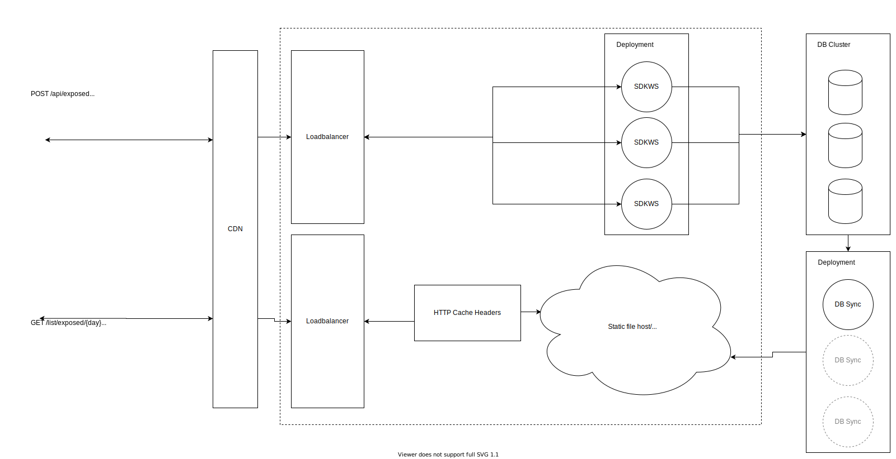

# DP3T-Backend-SDK


## DP3T
The Decentralised Privacy-Preserving Proximity Tracing (DP3T) project is an open protocol for COVID-19 proximity tracing using Bluetooth Low Energy functionality on mobile devices, which ensures that personal data and computation stay entirely on an individual's phone. It was produced by a core team of over 25 scientists and academic researchers from across Europe. It has also been scrutinized and improved by the wider community.

DP3T is a free-standing effort, begun at the EPFL and ETHZ, where the protocol was produced and where the implementation into an open-sourced app and server is taking place.


## Introduction
This is the first implementation of the DP-3T "low bandwidth" protocol. The current implementation does not use the as yet unreleased "Contact Tracing" API of Apple/Google, and as such, **might suffer from some limitations**. Our "hybrid approach" uses Bluetooth Low Energy (BLE) to exchange EphID's. It uses advertisements whenever possible and falls back to GATT Server connections if transmission/collection of an `EphID` is not possible in this way (e.g., on iOS devices when the app is in background). This approach can result in higher energy consumption and scalability issues and will be replaced by the Apple/Google API.

Our immediate roadmap is: to support the Apple/Google wire protocol, to be forward-compatible, and to support the actual Apple/Google API as soon as it is released to iOS and Android devices.

## Contribution Guide
The DP3T backend is not yet complete. It has not yet been reviewed or audited for security and compatibility. We are both continuing the development and have started a security review. This project is truly open-source and we welcome any feedback on the code regarding both the implementation and security aspects.

Bugs or potential problems should be reported using Github issues. We welcome all pull requests that improve the quality the source code.

If you provide new extensions and need to adjust the config files, try to add new profiles. This way, we can keep providing a highly modular backend solution. Since every country resp. implementation has different needs, we try not to enforce a certain method.

If you have contributions that include design changes of the currently accepted white paper, please start a discussion there. Since we are trying to release a first, best-effort version soon, we currently cannot accept any PRs that include non-approved design changes.

## Repositories
* Android SDK & Calibration app: [dp3t-sdk-android](https://github.com/DP-3T/dp3t-sdk-android)
* iOS SDK & Calibration app: [dp3t-sdk-ios](https://github.com/DP-3T/dp3t-sdk-ios)
* Android Demo App: [dp3t-app-android](https://github.com/DP-3T/dp3t-app-android)
* iOS Demo App: [dp3t-app-ios](https://github.com/DP-3T/dp3t-app-ios)
* Backend SDK: [dp3t-sdk-backend](https://github.com/DP-3T/dp3t-sdk-backend)

## Work in Progress
The DP3T-Backend-SDK contains alpha-quality code only and is not yet complete. It has not yet been reviewed or audited for security and compatibility. We are both continuing the development and have started a security review. This project is truly open-source and we welcome any feedback on the code regarding both the implementation and security aspects.
This repository contains the open prototype SDK, so please focus your feedback for this repository on implementation issues.

## Further Documentation
The full set of documents for DP3T is at https://github.com/DP-3T/documents. Please refer to the technical documents and whitepapers for a description of the implementation.

## Architecture
A central discovery service is hosted on [Github](https://github.com/DP-3T/dp3t-discovery). This server provides the necessary information for the SDK to initialize itself. After the SDK loads the base URL for its own backend, it will load the infected list from there, as well as post if a user is infected. This will also allow apps to fetch lists from other backend systems participating in this scheme and can handle roaming of users.

The SDK-Backend provides an interface to publish exposed keys and get a list of exposed keys.

> Note that the requests on the image are not the actual endpoints in the reference implementation. They differ in the picture to show the possible separation of the two requests. For the actual endpoint paths, refer to the backend documentation further down (e.g. PDF or OpenAPI).



### General
This repository contains a backend implementation (webservice) written with Spring Boot, which implements the specification of the Decentralized Privacy-Preserving Proximity Tracing system.


### Dependencies
* Spring Boot 2.2.6
* Java 8 (or higher)
* Logback
* [Springboot-Swagger-3](https://github.com/Ubique-OSS/springboot-swagger3) (Github Package, plugin dependency)

### Database
For development purposes an hsqldb can be used to run the webservice locally. For production systems, it is recommended to connect to a PostgreSQL dabatase (cluster if possible). The simple database schema is described in the following diagram:


### API
> Note that currently, documentation cannot be generated automatically. Hence, the generated swagger might not be up-to-date. If you checkout the repo, you can use the make doc command to generate a new swagger file (though without any documentation strings).

The backend API specification is documented here:
* [PDF](/documentation/documentation.pdf)
* [Swagger Editor](https://editor.swagger.io/?url=https://raw.githubusercontent.com/DP-3T/dp3t-sdk-backend/develop/documentation/yaml/sdk.yaml)

### Configurations
To control different behaviors, SpringBoot profiles are used. The idea is to provide an abstract base class, which defines everything needed. Such properties can be defined as abstract, and their implementation can be provided in an extended class.

#### WSCloud*Config/WSProdConfig/WSDevConfig
Currently three non-abstract configs (`dev`, `abn` and `prod`) are provided, which are used in the current deployed version of the backend. Those are the CloudConfigs and they are optimized to work with an environment using KeyCloak and CloudFoundry. 

Furthermore, two non-abstract configs (`dev`, `prod`) are provided, which implement a basic configuration, and which should work out-of-the-box. It generates new key pairs, used to sign the payload, each time the web service is started. For an example on how to persist the keys across startup, have a look at the cloud configs.

> Note that the `dev` config uses a HSQLDB, which is non-persistent, whereas `prod` needs a running instance of PostgreSQL (either in a docker or native).

If you plan to provide new extensions or make adjustments and want to provide those to the general public, it is recommended to add a new configuration for your specific case. This can be e.g. an abstract class (e.g. WSCloudBaseConfig), which extends the base class providing certain needed keys or functions. If you provide an abstract class, please make sure to add at least one non-abstract class showing the implementation needed.

#### WSJWTConfig
There is also a possible extension to the base web service provided. The JWT config is intended to implement a possibility to authorize the post requests used to publish the secret keys from the clients. JWTs, which are signed by a health authority, are used. An interface is provided, which can be used to define the behavior of authorization (c.f. the `ValidateRequest` class and its implementation in `NoValidateRequest` and `JWTValidator`). 


### Public/Private KeyPairs
There are multiple ways of generating and using key pairs. In the cloud configs, the public key is read from a certificate provided via SpringBoot value injection. The private key is a PKCS8-PEM encoded private key. In the default configs, the key pairs are generated via helper functions from the JWT-library used.

There are two files, `GenerateKeyPair.java` (outputs directly the keys) and `GenerateKeyPairEC.java` (preferred way of generating key pairs, uses PEM format) to give an idea on how to generate them by yourselves. In order to load the keys generated by those files, you can directly use the Java provided `X509EncodedKeySpec` (resp. `PKCS8EncodedKeySpec`) classes. To load the keys as they are generated by the files, generate a new config and override the methods like this (for non PEM keys `GenerateKeyPair.java`):

```java
@Override
public KeyPair getKeyPair(SignatureAlgorithm algorithm) {
    return new KeyPair(loadPublicKeyFromString(),loadPrivateKeyFromString());
}

private PrivateKey loadPrivateKeyFromString() {
    PKCS8EncodedKeySpec pkcs8KeySpec = new PKCS8EncodedKeySpec(Base64.getDecoder().decode(privateKey));
    try {
        KeyFactory kf = KeyFactory.getInstance("EC");
        return (PrivateKey) kf.generatePrivate(pkcs8KeySpec);
    }
    catch (Exception ex) {
        ex.printStackTrace();
        throw new RuntimeException();
    }
}

private PublicKey loadPublicKeyFromString() {
    X509EncodedKeySpec keySpecX509 = new X509EncodedKeySpec(Base64.getDecoder().decode(publicKey));
    try {
        KeyFactory kf = KeyFactory.getInstance("EC");
        return (PublicKey) kf.generatePublic(keySpecX509);
    }
    catch (Exception ex) {
        ex.printStackTrace();
        throw new RuntimeException();
    }
}
```

or like that (for PEM keys `GenerateKeyPairEC.java`):

```java
@Override
	public KeyPair getKeyPair(SignatureAlgorithm algorithm) {
		Security.addProvider(new BouncyCastleProvider());
		Security.setProperty("crypto.policy", "unlimited");
		return new KeyPair(loadPublicKeyFromString(),loadPrivateKeyFromString());
	}

	private PrivateKey loadPrivateKeyFromString() {
		try {
			String privateKey = getPrivateKey();
			Reader reader = new StringReader(privateKey);
			PemReader readerPem = new PemReader(reader);
			PemObject obj = readerPem.readPemObject();
			PKCS8EncodedKeySpec pkcs8KeySpec = new PKCS8EncodedKeySpec(obj.getContent());
			KeyFactory kf = KeyFactory.getInstance("EC");
			return (PrivateKey) kf.generatePrivate(pkcs8KeySpec);
		}
		catch (Exception ex) {
			ex.printStackTrace();
			throw new RuntimeException();
		}
	}

	private PublicKey loadPublicKeyFromString() {
		try {
				Reader reader = new StringReader(getPublicKey());
				PemReader readerPem = new PemReader(reader);
				PemObject obj = readerPem.readPemObject();
				return KeyFactory.getInstance("EC").generatePublic(
						new X509EncodedKeySpec(obj.getContent())
				);
		}
		catch (Exception ex) {
			ex.printStackTrace();
			throw new RuntimeException();
		}
	}
```

Depending on the key-size and the algorithm and/or if you are using the `PemReader`, you may need to add [BouncyCastle](https://www.bouncycastle.org/) (c.f. [Export/Import regulations](https://crypto.stackexchange.com/questions/20524/why-are-there-limitations-on-using-encryption-with-keys-beyond-certain-length)).

> Note that the `KeyFactory` class provides a `getInstance(String algorithm, String provider)` overload as well (e.g. you need larger key sizes provided by `BouncyCastle`). You can essentially exchange `ECDSA` and `RSA` whenever you like. For production use, please make sure that you double check the key specifications. The two files provided just use the default parameters, which may or may not be sufficient for your use case.

### Build
The `maven-toolchains-plugin` is used to provide the maven compiler with the correct toolchain. So you may need to add a `toolchains.xml` file to your `~/.m2` maven config folder (or remove the plugin from the `pom.xml`). Here is an example for a mac environment. Make sure to replace `<jdkHome>` with the path to your `JAVA_HOME`.

```xml
<toolchains>
<toolchain>
    <type>jdk</type>
    <provides>
      <id>Java11</id>
      <version>11</version>
    </provides>
    <configuration>
      <jdkHome>/Library/Java/JavaVirtualMachines/jdk-11.0.2.jdk/Contents/Home</jdkHome>
    </configuration>
  </toolchain>
  <toolchain>
    <type>jdk</type>
    <provides>
      <id>Java8</id>
      <version>8</version>
    </provides>
    <configuration>
      <jdkHome>/Library/Java/JavaVirtualMachines/jdk1.8.0_201.jdk/Contents/Home</jdkHome>
    </configuration>
  </toolchain>
</toolchains>
```

To build you need to install Maven.

```bash
cd dpppt-backend-sdk
mvn install
```

> Note to run the PostgreSQL unit tests, `dockerd` is needed. If you want to skip those tests add `-DskipTests` to the build command. 

### Run
```bash
java -jar dpppt-backend-sdk-ws/target/dpppt-backend-sdk-ws-*.jar
```
### Dockerfiles
The dockerfile includes a base jdk image to run the jar. To actually build the docker container, you need to place the generated jar in the bin folder.

```bash
cp dpppt-sdk-backend/dpppt-backend-sdk-ws/target/dpppt-backend-sdk-ws-1.0.0-SNAPSHOT.jar ws-sdk/ws/bin/dpppt-backend-sdk-ws-1.0.0
```

```bash
cd ws-sdk && docker build -t <the-tag-we-use> .
```

```bash
docker run -p 80:8080 <the-tag-we-use>
 ```

### Makefile
You can use the provided makefile to build the backend, build a docker image and generate the documentation.

Without a target, the makefile will generate everything except the docker image.

```bash
make
``` 

To build the docker image run

```bash
make docker-build
```

## License
This project is licensed under the terms of the MPL 2 license. See the [LICENSE](LICENSE) file.
