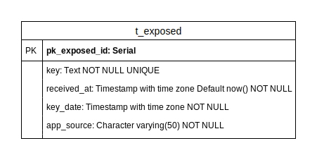
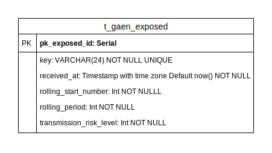

<!-- Issue templates and Contributing guides are taken from the fastlane repository and adjusted for our needs (https://github.com/fastlane/fastlane/tree/master/.github/ISSUE_TEMPLATE) and  -->
# DP3T-Backend-SDK


[](https://sonarcloud.io/dashboard?id=DP-3T_dp3t-sdk-backend)
[](https://sonarcloud.io/dashboard?id=DP-3T_dp3t-sdk-backend)

## License
This project is licensed under the terms of the MPL 2 license. See the [LICENSE](LICENSE) file.

## Repositories
* Android SDK & Calibration app: [dp3t-sdk-android](https://github.com/DP-3T/dp3t-sdk-android)
* iOS SDK & Calibration app: [dp3t-sdk-ios](https://github.com/DP-3T/dp3t-sdk-ios)
* Android Demo App: [dp3t-app-android](https://github.com/DP-3T/dp3t-app-android)
* iOS Demo App: [dp3t-app-ios](https://github.com/DP-3T/dp3t-app-ios)
* Backend SDK: [dp3t-sdk-backend](https://github.com/DP-3T/dp3t-sdk-backend)

## DP3T
The Decentralised Privacy-Preserving Proximity Tracing (DP3T) project is an open protocol for COVID-19 proximity tracing using Bluetooth Low Energy functionality on mobile devices, which ensures that personal data and computation stay entirely on an individual's phone. It was produced by a core team of over 25 scientists and academic researchers from across Europe. It has also been scrutinized and improved by the wider community.

DP3T is a free-standing effort, begun at the EPFL and ETHZ, where the protocol was produced and where the implementation into an open-sourced app and server is taking place.

## Contribution Guide

Please read the [Contribution Guide](CONTRIBUTING.md) before submitting any pull-request.

## Introduction

### Dependencies
* Spring Boot 2.2.6
* Java 8 (or higher)
* Logback
* [Springboot-Swagger-3](https://github.com/Ubique-OSS/springboot-swagger3) (Github Package, plugin dependency)

### Database
For development purposes an hsqldb can be used to run the webservice locally. For production systems, it is recommended to connect to a PostgreSQL dabatase (cluster if possible). There are two tables storing keys, one for the DP3T vendor independent format, one for the Google/Apple approach format. Further, to protect against JWT replay attacks a third table stores the JTI temporarily. The schemas are as following :






## Environments

## Legacy Notifications

## Exposure Notifications

## Swagger

We use [Springboot-Swagger-3](https://github.com/Ubique-OSS/springboot-swagger3) to generate a `YAML` based on settings and controllers found in the project. We include a up-to-date version in each release. Currently they are lacking the documentation, but should provide enough information to use them in [Swagger Editor](https://editor.swagger.io).

## Key Handling

There are multiple ways of generating and using key pairs. In the cloud configs, the public key is read from a certificate provided via SpringBoot value injection. The private key is a PKCS8-PEM encoded private key. In the default configs, the key pairs are generated via helper functions from the JWT-library used.

There are two files, `GenerateKeyPair.java` (outputs directly the keys) and `GenerateKeyPairEC.java` (preferred way of generating key pairs, uses PEM format) to give an idea on how to generate them by yourselves.

Depending on the key-size and the algorithm and/or if you are using the `PemReader`, you may need to add [BouncyCastle](https://www.bouncycastle.org/) (c.f. [Export/Import regulations](https://crypto.stackexchange.com/questions/20524/why-are-there-limitations-on-using-encryption-with-keys-beyond-certain-length)).

> Note that the `KeyFactory` class provides a `getInstance(String algorithm, String provider)` overload as well (e.g. you need larger key sizes provided by `BouncyCastle`). You can essentially exchange `EC` and `RSA` whenever you like. For production use, please make sure that you double check the key specifications. The two files provided just use the default parameters, which may or may not be sufficient for your use case.

To load the keys you can use the `KeyVault` class. The class works by registering functions, which implement a possible decoding from a `String` to a `KeyPair` (respectively `PrivateKey` or `PublicKey`). To register a new provider, the static functions `registerNewPublicEncodingProvider` and `registerNewPrivateEncodingProvider` can be used. Have a look at the `KeyVault` class to see examples of decoding providers.

There are two possible ways of using the class. The recommended way is, to load it as a `Bean` and define all the `KeyPairs` used. The `KeyVault` is autowired into the `BaseConfiguration` and hence needs a instance, provided by one of the concrete configurations. Here is an example from the `DevConfig`:

```java
var gaen = new KeyVault.KeyVaultEntry("gaen", getPrivateKey(), getPublicKey(), "EC");
var nextDayJWT = new KeyVault.KeyVaultEntry("nextDayJWT", getPrivateKey(), getPublicKey(), "EC");
var hashFilter = new KeyVault.KeyVaultEntry("hashFilter", getPrivateKey(), getPublicKey(), "EC"); 

try {
  return new KeyVault(gaen, nextDayJWT, hashFilter);
} catch (PrivateKeyNoSuitableEncodingFoundException | PublicKeyNoSuitableEncodingFoundException e) {
  throw new RuntimeException(e);
}
```
The constructor inserts the `KeyPairs` into a hashmap, from which you can get the entries.

One does not need to use the constructor though, since the static functions `loadPrivateKey` and `loadPublicKey` can be used directly as well. It can be convenient, if one does not need to provide a `KeyPair` as, for example when only the `PublicKey` is provided, to verify signatures. The following code shows how to load a `PublicKey`.

```java
KeyVault.loadPublicKey(loadPublicKey(), "RSA")
```

In any case the `loadPrivateKey` and `loadPublicKey` functions will iterate through all providers until one succeeds, or else an exception is thrown. The following providers are registered, when the class is instantiated (via `@Bean` for example):
#### PrivateKey
- `loadPrivateKeyFromJavaEncoding`: Loads a private key from a Base64 encoded version of the output of `PrivateKey.getEncoded()`.

- `loadPrivateKeyFromPem`: Loads the private key from the contents of a PEM file.

#### PublicKey
- `loadPublicKeyFromJavaEncoding`: Loads a public key from a Base64 encoded version of the output of `PublicKey.getEncoded()`.

- `loadPublicKeyFromPem`: Loads the public key from the contents of a PEM file.

- `loadPublicKeyFromX509Certificate`: Loads the public key from a certificate.

### Build
To build you need to install Maven.

```bash
cd dpppt-backend-sdk
mvn install
```

> Note to run the PostgreSQL unit tests, `dockerd` is needed. If you want to skip those tests add `-DskipTests` to the build command. 

### Run
```bash
java -jar dpppt-backend-sdk-ws/target/dpppt-backend-sdk-ws-*.jar
```
### Dockerfiles
The dockerfile includes a base jdk image to run the jar. To actually build the docker container, you need to place the generated jar in the bin folder.

```bash
cp dpppt-sdk-backend/dpppt-backend-sdk-ws/target/dpppt-backend-sdk-ws-1.0.0-SNAPSHOT.jar ws-sdk/ws/bin/dpppt-backend-sdk-ws-1.0.0
```

```bash
cd ws-sdk && docker build -t <the-tag-we-use> .
```

```bash
docker run -p 80:8080 <the-tag-we-use>
 ```

### Makefile
You can use the provided makefile to build the backend, build a docker image and generate the documentation.

Without a target, the makefile will generate everything except the docker image.

```bash
make
``` 

To build the docker image run

```bash
make docker-build