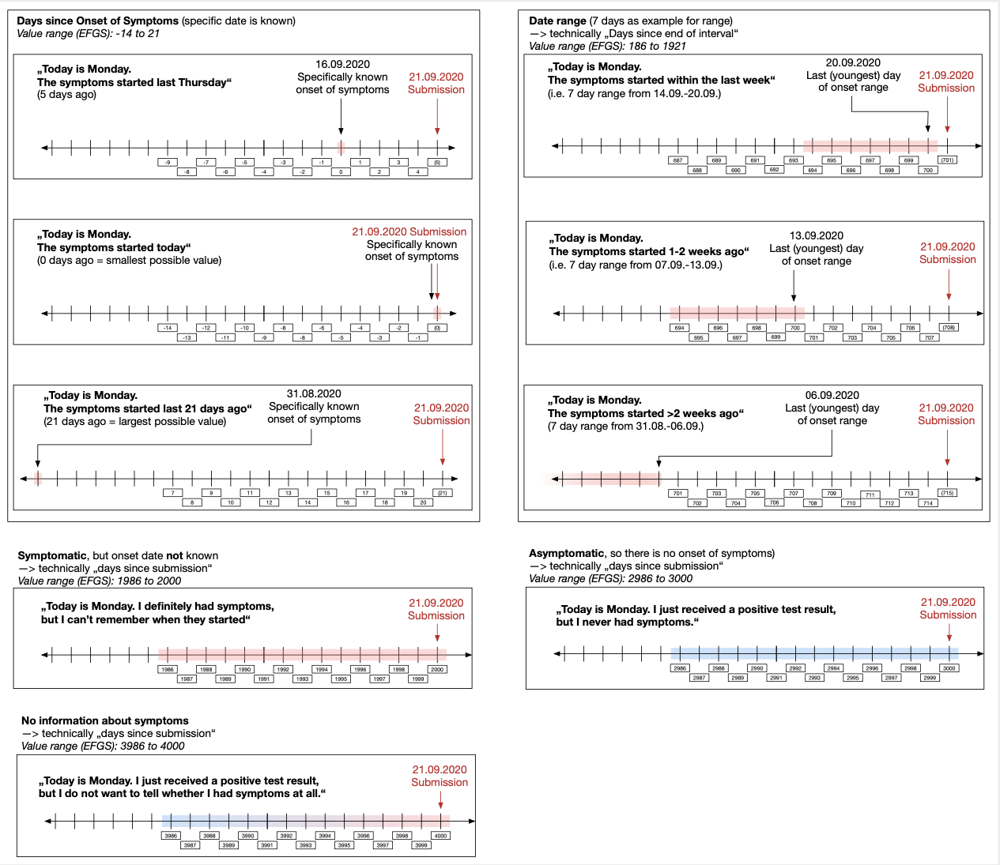

# Interoperability

## Introduction

The Interoperability Service operates as a single standalone micro service. It periodically connects to the Federation Gateway Service to exchange any new keys from and to the `dpppt-backend-sdk-ws`-Database. The service uses mTLS to connect to the Federation Gateway and a default database connector to connect to the database. 

Hence, the service needs the capability to connect to external services. Further, in order for mTLS to work, the connection _MUST_ either _NOT_ be proxied (peer to peer connection), or the load balancer used _MUST_ support establishing mTLS connection based on certificate finger/thumb prints.

Further, as the `dpppt-backend-sdk-ws` the Interoperability Service needs access to the database storing the EN-Keys.
## Federation Gateway Options
As for the `dpppt-backend-sdk-ws` different configuration classes provide the option to parameterize the runtime behavior of the interoperability service. 

Most of the properties found in the `WSBaseConfig` are similar to the ones found in the `WSBaseConfig` of the `dpppt-backend-sdk-ws`. Hence we only go into details for interoperability specific options. In contrast to the `dpppt-backend-sdk-ws` the interoperability service also uses configuration beans (c.f. `HubConfigs` and `EfgsGatewayConfig`).

### WSBaseConfig
- `interops.origin.country`: This property holds the [ISO-3166-1-Alpha-2](https://en.wikipedia.org/wiki/List_of_ISO_3166_country_codes) identifier for the country in which the service runs. This property will be added to keys which were uploaded via the `dpppt-backend-sdk-ws` and hence did not come from the federation gateway. *DEFAULT: null* - since this property needs to be specified by the country starting the service, it should fail if it was forgotten (not specified).

- `interops.efgs.dsosfilter.enabled`: Flag indicating if the `days since onset of symptoms filters` (DsosFilter) should be enabled or not. See the section about `Days Since Onset of Symptoms` for further information on the encoding and purpose of `dsos`. If enabled the filter will be injected into the filter pipeline and keys not matching the following criteria are filtered out. *DEFAULT: true*

- `interops.efgs.dsosfilter.symptomaticOnsetKnown.dropDaysBeforeOnset`: Drop keys which are older than `onset - n` and the onset of symptoms is known. Negative values reference to days *before* onset. *DEFAULT: -2*

- `interops.efgs.dsosfilter.symptomaticOnsetRange.dropDaysBeforeRangeStart`: Drop keys which are older than `onset - range - n`, where range specifies the range of days where the symptoms could have started. Negative values reference to days *before* onset. *DEFAULT: -2*

- `interops.efgs.dsosfilter.symptomaticOnsetKnown.dropDaysBeforeSubmission`: Drop keys keys which are older than `submission - n` where submission indicates the submission date of the keys, and the onset date is not known at all. Negative values reference to days *before* onset. *DEFAULT: -2*

- `interops.efgs.dsosfilter.asympomatic.dropDaysBeforeSubmission`: Drop keys which are older than `submission - n`, where submission indicates the submission date of the keys, and the person uploading the keys was asymptomatic. Negative values reference to days *before* onset. *DEFAULT: -2*

- `interops.efgs.dsosfilter.unknownSymptomStatus.dropDaysBeforeSubmission`: Drop keys which are older than `submission - n`, where submission indicates the submission date of the keys, and it is not known if the person uploading the keys was symptomatic or asymptomatic. Negative values reference to days *before* onset. *DEFAULT: -2*
### Configuration Properties
For the gateway configuration SpringBoot `@ConfigurationProperties` classes are used. They allow to group multiple properties or environment variables into one class, based on a specific prefix (e.g. `interops.hubs` -> `interops.hubs.efgsGateways[0].id=efgs-gateway`). 

---

**NOTE**

Although technically the interoperability service would support configuring multiple gateways, as of now only the first configuration is used!

---

#### `HubConfigs`

This class holds a list of gateway configurations.
#### `EfgsGatewayConfig`
This class holds all the necessary configuration options to communicate and synchronize with a federation gateway. The implementation should be compatible with the original EFGS implementation and the Swiss implementation (CHGS). For detailed description on the communication protocols with the federation gateway, we refer to the corresponding documentation in the Github repos linked below.

The Federation Gateway deploys to means of security: the first is a mutual TLS connection, where a client certificate is used to prove the identity to the gateway system. Further, every "batch" (collection of exposure keys) is signed to prove the authenticity of the submitted data. Hence, the interoperability service needs two different key-pairs, an authentication pair and a signing pair.

The key exchange is outside the scope of this documentation, and the EFGS documentation should be consulted. For countries hosting their own gateway service, a set of tools to simplify the process of creating and exchanging certificates is available on the EFGS repository.

- `id`: An identifier for this gateway configuration.

- `baseUrl`: The base URL pointing to the federation gateway. All routes will be relative to the base URL.

- `authClientCert`: A base64 encoded String of a P12 containing the private key and the certificate used for mutual TLS communication.

- `authClientCertPassword`: The password set to protect the `authClientCert` P12.

- `signClientCert`: A base64 encoded String of a P12 containing the private key and the certificate used for signing the batches.

- `signClientCertPassword`: The password set to protect the `signClientCert` P12.

- `signAlgorithmName`: The signature algorithm used to sign the batches. Note that the algorithm _MUST_ match the key type given by the `signClientCert` (e.g. `sha256WithRSAEncryption`). The string value is directly used in the constructor of `JcaContentSignerBuilder`, hence check the `BouncyCastle` documentation for supported signature types.

- `visitedCountries`: List of strings to indicate which countries a key visited. For now this all uploaded keys are marked with all countries present in `visitedCountries`, so theoretically the keys would always be distributed to all countries. This might change in the future. Though, since it is extremely hard to anonymize the list of visited countries on a individual level, the decision to distribute _all_ the key material to _all_ countries was preferred over a complex obfuscation scheme.

- `defaultTransmissionRiskLevel`: This value is not used anymore and defaults to `Integer.MAX_VALUE`. Keep in mind that Java does not interpret unsigned integers, so the decimal, numerical value is `2147483647`. On a byte level this corresponds to `0x7f_ff_ff_ff`.

- `defaultReportType`: When no `ReportType` is given, use `defaultReportType` instead. The default is `ReportType.CONFIRMED_TEST`.

## Federation Gateway Synchronization

The Interoperability Service will synchronize with the Federation Gateway service with a period defined by the cron string in the `WSSchedulingBaseConfig`. This defaults to `0 0/10 * * *`, meaning the sync starts every 10 minutes starting at 00:00. During the synchronization two events happen: first the Interoperability Service tries to download new keys for the last `n` days. Then all keys, which are allowed to be released and haven't been released before are uploaded to the Federation Gateway. Since the potential payload of such requests can be quite large, a batching logic is applied, which is further described in the next parts.

Further, the sync status is logged and saved in the database for future retrieval. Those entries are being used during download, in order to reduce load on the Federation Gateway, since the Interoperability Service can start directly from the last retrieved batch, rather than following the linked list from the start (in case of longer down time periods extending over date boundaries, we otherwise could miss keys uploaded late at night).

### Download Batching Logic

According to the documentation of the EFGS, calls to the download endpoint have a required parameter - the date for which keys were uploaded - and an optional parameter, specifying the batch the client downloaded last. Since the batches for a specific day are implemented as a linked list, where each response contains the next batch tag, or null if there aren't any left, specifying a batch tag allows skipping the `n` batches before `batchTag`. This helps reduce the load on the Federation Gateway and simplifies insertion logic on the Interoperability Service, as we can avoid trying to insert already inserted keys.

The Interoperability Service therefore implements the following batch logic:

#### Download 

1) get `batchTag` of last successfully downloaded batch from `today - retentationDay` (this is needed, as we cannot know if we downloaded the last batch, as it could be that the Interoperability Services was shut down over a certain period of time)

2) use `batchTag` to download the next available batch.

3) if the `batchTag` of the newly downloaded batch is not empty, and the batch itself is non empty, insert it into the database

4) check if the `nextBatchTag` is not null and goto `2)`

5) increase the `downloadDate` by 1 and repeat `2)` through `4)` (until the last batch of today is downloaded)

### Uploading Batching Logic

During upload the EFGS documentation specifies that a batch _MUST NOT_ exceed 4000 keys. Hence, if more keys are available, the set of keys has to be partitioned. Each of those batches a unique batch tag has to be assigned. 
#### Upload

1) get all keys which are available for upload

2) partition keys into subsets with a size of maximal `MAX_UPLOAD_BATCH_SIZE`

3) for each partition assign a unique `batchTag` and upload to EFGS
## Days Since Onset of Symptoms

Since the EN framework does not provide a way to encode meta information about the infection of someone who uploaded the key. This though can be crucial (e.g.symptomatic vs asymptomatic, or fixed onset vs ranged onset) in certain situations to estimate the risk factor on the client.

In order to solve this flaw of the EN framework, the EFGS introduced an encoding of such meta information into the `days_since_onset_of_symptoms` field of the EN struct. The following is an overview of how the encoding works, and explained in context of the `EfgsDsosFilter` class used in the Swiss instance.

The encoding uses mutually exclusive ranges over the whole domain of possible values ( the `days_since_onset_of_symptoms` field is a signed 32-bit integer) to encode different ways of explaining the circumstances of the onset of symptoms and the date. 
### Symptomatic with known onset
`Range: [-14,+14]`

`0: Onset coincides with today's key date`

User knows exactly the Date of onset of Symptoms (e.g. cough started 5 days ago before submission)
### Symptomatic with onset range of `n` days
`Range: [n*100-14,n*100+14]`

`n*100: Onset coincides with yesterday's key date`

User knows just a time range. (e.g. cough started within the last week)

### Symptomatic with unknown onset (days since submission)
`Range: [2000-14,2000+14] = [1986, 2014]`

`2000: The onset coincides with this keys' date`

User knows that he had symptoms, but didn't know exactly when they started. 

### Asymptomatic (days since submission)
`Range: [3000-14,3000+14] = [2986, 3014]`

`3000: The onset coincides with this keys' date`

User knows that he had definitely nothing (e.g. never had cough, fever etc.)

### Unknown symptom status (days since submission)
`Range: [4000-14,4000+14] = [3986, 4014]`

`4000: The onset coincides with this keys' date`

User does not know which Symptoms are Covid-symptoms or he did something wrong in the app during the submission.

--- 
Figure 1: An overview of the DSOS values and their meaning. Figure was taken from EFGS documentation.

---
## References
- [European Federation Gateway Service](https://github.com/eu-federation-gateway-service/efgs-federation-gateway)
- [Swiss Federation Gateway Service](https://github.com/admin-ch/chgs-federation-gateway)